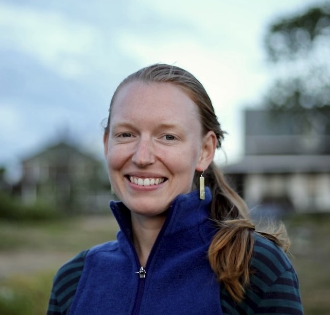

Broadly, I am interested in how to keep ecosystems healthy in the face of change. In my research, I study how and when short-term plant and insect responses to environmental variability (including physiological, phenotypic, and behavioral responses) affect the long-term dynamics of plant-pollinator communities. In practice this involves counting flowers, catching pollinators, and developing mathematical and statistical models. In addition, I conduct education research to identify and counteract barriers to the success of underrepresented students in biology. Before starting at UW, I worked with the USGS at the West Glacier field station in Montana. I have also done research (mostly plant ecology) in the Colorado Rockies, the White Mountains in New Hampshire, and in the Arctic. In addition to science, I like tea, community, and people-powered transportation (bikes, skis, hiking boots etc.).

*Updated December 2023*

---

### Education
**Middlebury College (2016-2020)**

Middlebury, VT

B.A. in Biology 

### Publications
Sumitra Tatapudy, Rachel Potter, Linnea Bostrom, **Anne Colgan**, Casey J. Self, Julia Smith, Shangmou Xu, and Elli J. Theobald. 2024. [Visualizing Inequities: A Step Toward Equitable Student Outcomes](https://doi.org/10.1187/cbe.24-02-0086). CBE—Life Sciences Education (23)4.

**Anne Colgan**, Richard G. Hatfield, Amy Dolan, Wendy Velman, Rebecca Newton, and Tabitha A. Graves. 2024. [Quantifying effectiveness and best practices for bumblebee identification from photographs](https://doi.org/10.1038/s41598-023-41548-w). Sci Rep (14)830.

Georgia L.D. Murray, **Anne M. Colgan**, Sarah J. Nelson, Eric P. Kelsey, and Kenneth D. Kimball. 2021. [Climate Trends on the Highest Peak of the Northeast: Mount Washington, NH.](https://doi.org/10.1656/045.028.s1105) Northeastern Naturalist 28(sp11):64-82.

---

### Contact

acolgan@uw.edu