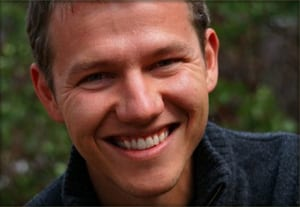

I'm a community ecologist interested in how the structure of ecological networks affects their dynamics and functioning, including in response to ongoing global environmental changes. Much of our work uses plant-pollinator networks as a model system. 

We use a range of scientific approaches including comparative and manipulative field studies, controlled laboratory experiments, mathematical modeling, population genetics, stable isotope studies, and GIS and remote sensing. Our research has been funded by the National Science Foundation, the US Department of Agriculture, the National Institutes of Health, and the Army Research Office among other sources.

---

