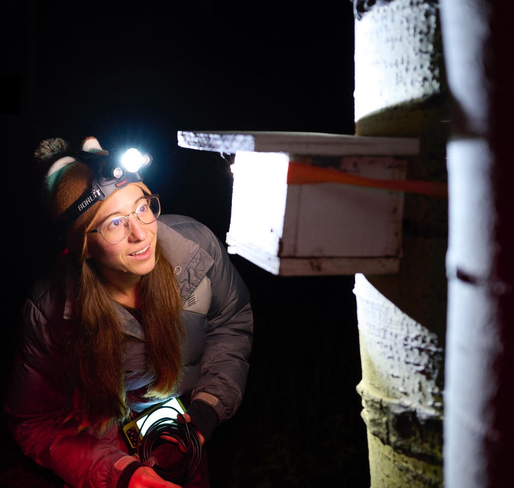

I am an organismal ecologist interested in the mechanistic links between individual behavior and physiology and population-level trends. As an NSF Postdoctoral Research Fellow in Biology, I am investigating the mechanistic causes of range contractions in bumble bees. I am broadly interested in promoting pollinator and wildlife conservation and sustainable land management, as well as cultivating scientific curiosity and environmental stewardship in our communities.

*Updated October 2024*

---

### Education

PhD in Entomology, 2022
University of California, Riverside

Bachelor of Arts in Biology, 2014
Colorado College

### Publications
	 	 								
Sarro Gustilo E, K Fisher, SH Woodard (2023) [Parental care behavior in bumble bee queens is tightly regulated by the number of helpers in incipient nests](https://doi.org/10.1016/j.anbehav.2023.07.009). Animal Behaviour. 203, 241-250. 						

Sarro E (2022) [Bumble bee queen plasticity and social regulation of traits.](https://escholarship.org/uc/item/9x39453s) UC Riverside eScholarship. 	

Sarro E, A Tripodi, SH Woodard (2022) [Bumble bee (B. vosnesenskii) queen nest searching occurs independent of ovary developmental status.](https://doi.org/10.1093/iob/obac007) Integrative Organismal Biology. obac007. 		

^Fisher K, ^Sarro E, *C Miranda, *B Guillen, SH Woodard (2022) [Worker task organization in incipient bumble bee nests. Animal Behaviour.](https://doi.org/10.1016/j.anbehav.2021.12.005) 185:143-161. 

Sarro E, P Sun, K Mauck, *D Rodriguez-Arellano, N Yamanaka, SH Woodard (2021) [An organizing feature of bumble bee life history: worker emergence promotes queen reproduction and survival in young nests.](https://doi.org/10.1093/conphys/coab047) Conservation Physiology 9(1):coab047.  

^shared first authorship; *undergraduate mentee

---

### Contact

gustiloe@uw.edu

[Website](https://erica-sarro.github.io/)

