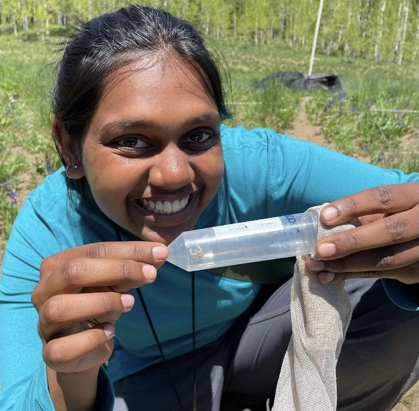

I am generally interested in exploring the ecological drivers that influence pollinator visitation and foraging decisions. I'm especially interested in studying this from a molecular perspective, and understanding the genetic consequences of pollinator foraging on plant reproduction and fitness. My senior thesis explored the relationship between temperature fluctuation and pollinator niche dynamics in the Rocky Mountains. I'm also interested in community-oriented science, and am  coordinator of the MeadoWatch program!
 
*Updated October 2023*

---

### Education

Northeastern University (2018 - 2022)

Boston, MA

B.S. in Environmental Science 

### Experience

Brosi Lab, *Undergraduate Researcher* (Jun 2021 - Aug 2022)

The Echinacea Project, *Research Technician* (Sept 2022)

Boston Water and Sewer Commission, *GIS Assistant* (Jan – March 2020)

Trussell Lab, *Undergraduate Researcher* (Jun 2019 - Dec 2019)

---

### Contact

mchandar@uw.edu

