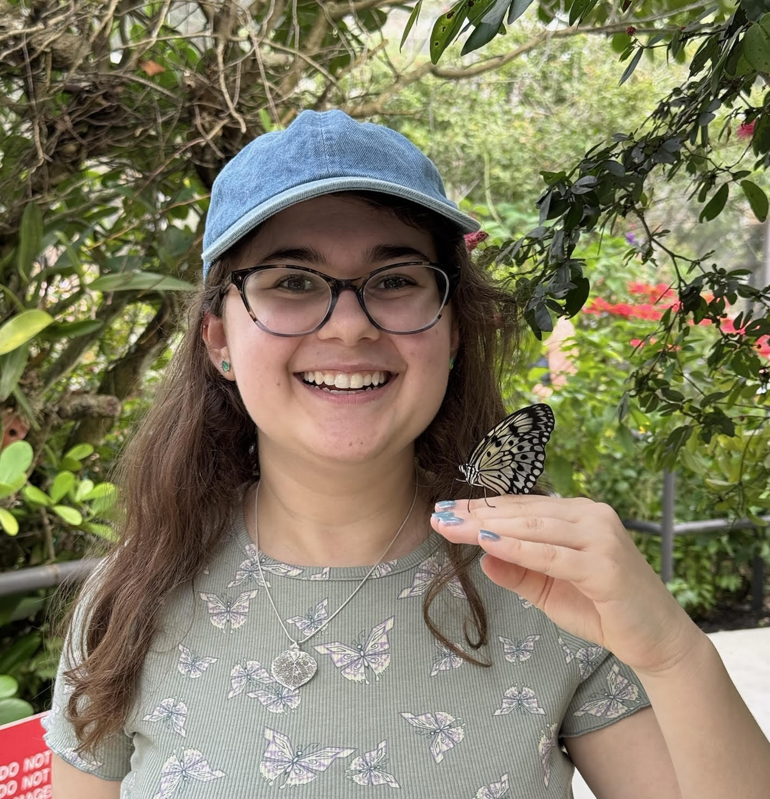

I am a quantitative ecologist studying the mechanistic underpinnings of complex systems and their resilience to perturbations. My research examines stability and complexity across different levels in both ecological and classroom settings. In my ecology research, I develop population-dynamic models to reveal vulnerabilities in plant-pollinator networks that simpler topological approaches miss, and explore how adaptive foraging behavior influences network structure and robustness. 

In my education research, I investigate the complex relationship between classroom anxiety and student performance through a Control Value Theory framework, challenging the assumption that anxiety only plays a negative role. My ultimate goal is to understand the conditions that allow individuals and communities to respond to disruptions and stressors in their environments in order to thrive. Outside of my graduate research, the activities I do to help me feel happy include crafting, gardening, and enjoying soup (Seattle is a good place for soup weather).

---

### Education
**University of California Los Angeles** (2020 - 2022)

Los Angeles, CA

M.S. in Ecology & Evolutionary Biology; CIRTL Scholar certification

**University of Chicago** (2015 - 2019)

Chicago, IL

B.S. in Biology, Minor in Statistics

---

### Publications

Sumitra Tatapudy, **Rachel Potter**, Linnea Bostrom, Anne Colgan, Casey J. Self, Julia Smith, Shangmou Xu, and Elli J. Theobald. 2024. [Visualizing Inequities: A Step Toward Equitable Student Outcomes](https://doi.org/10.1187/cbe.24-02-0086). CBE—Life Sciences Education (23)4.

---

### Contact

rbpotter@uw.edu