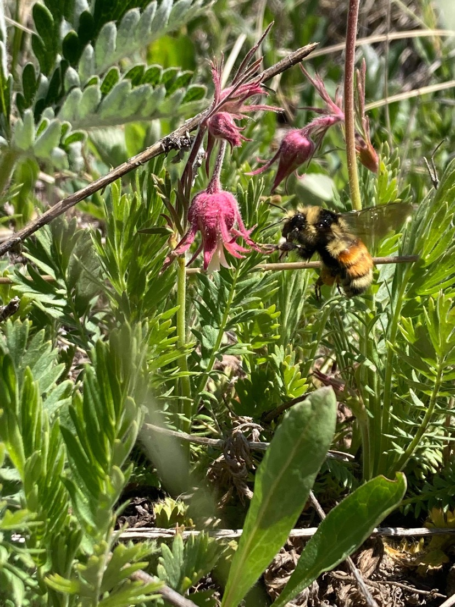

“DNA metabarcoding” is the use of genetic markers to taxonomically identify mixed-species samples, using high-throughput DNA sequencing. We got interested in developing methods for DNA metabarcoding of pollen in order to build highly-resolved pollination networks via molecular identification of pollen carried by pollinators, but it also has a range of other interesting and important applications from forensics to provenance identification to paleontology. Our past methods development work on this topic, and our current work on quantitation, have been supported by the Army Research Office.  Karen Bell, a former post-doc in our lab and currently a faculty member at the University of Western Australia and CSIRO, is a key collaborator in this work.

