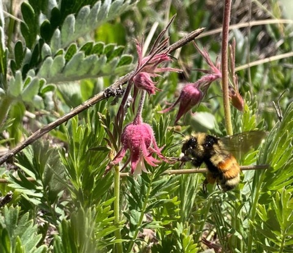

“DNA metabarcoding” is the use of genetic markers to taxonomically identify mixed-species samples, using high-throughput DNA sequencing. We got interested in developing methods for DNA metabarcoding of pollen in order to build highly-resolved pollination networks via molecular identification of pollen carried by pollinators, but it also has a range of other interesting and important applications from forensics to provenance identification to paleontology. Our past methods development work on this topic, and our current work on quantitation, have been supported by the Army Research Office.  Karen Bell, a former post-doc in our lab and currently a faculty member at the University of Western Australia and CSIRO, is a key collaborator in this work.

 

## Key Papers:

Bell KL, Turo KJ, Lowe A, Nota K, Keller A, Encinas-Viso F, Parducci L, Richardson R, Legget RM,
Brosi BJ, Burgess KS, Suyama Y, de Vere N. 2022. [Plants, pollinators and their interactions under global ecological change: The role of pollen DNA metabarcoding](https://doi.org/10.1111/mec.16689). Molecular Ecology.

Bell KL, MacPherson JM, Cutler A, Dobbs E, Read TD, Burgess KD, Brosi BJ. 2021.[Comparing whole genome shotgun sequencing and DNA metabarcoding approaches for species identification and quantification of pollen species mixtures](https://doi.org/10.1002/ece3.8281). Ecology and Evolution 11:16082–16098.

Bell KL, Burgess KS, Dobbs EK, Botsch JC, Read TD, Brosi BJ. 2019. [Quantitative and qualitative assessment of pollen DNA metabarcoding using constructed species mixtures](https://doi.org/10.1111/mec.14840). Molecular Ecology 28:431–
455

Lucas A, Bodger O, Brosi BJ, Ford C, Forman D, Greig C, Hegarty M, Neyland P, de Vere N. 2018.
[Generalisation and specialisation in hoverfly (Syrphidae) grassland pollen transport networks revealed by DNA metabarcoding](https://doi.org/10.1111/1365-2656.12828). Journal of Animal Ecology 87:1008–1021.

Bell KL, Fowler J, Burgess KS, Dobbs EK, Gruenewald D, Lawley B, Morozumi C, Brosi BJ. 2017. [Applying pollen DNA metabarcoding to the study of plant-pollinator interactions](https://doi.org/10.3732/apps.1600124). Applications in Plant Sciences. 5(6): 1600124.

