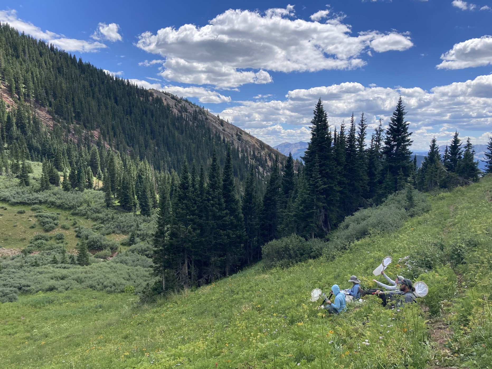

We are broadly interested in how the structure of ecological networks affects their stability and functioning, how networks respond to perturbations, and more generally their dynamics and evolution. Most of our work focuses on mutualistic networks, particularly pollination networks, but we are interested in all kinds of ecological interactions, and especially in combining multiple interaction types in the same network. A particular goal is to better integrate theory and empirical data, an integration that remains rare in mutualistic network studies.

We have explored this through manipulative work on the effects of accelerated snowmelt — a key predicted effect of global climate change in montane systems—on pollination network structure and plant reproductive functioning

Our current work on networks is supported by an NSF award alongside [Fernanda Valdovinos](https://www.fsvaldovinos.com/) (UC Davis) and [Mark Novak](https://novaklabosu.github.io/) (Oregon State), utilizing data-theory integration to understand the timescale-dependent effects of transient dynamics in plant-pollinator networks. As part of this work, we will be hosting a [data-theory integration workshop](https://models4data2theory.github.io/) in 2024. 

 

## Key Papers 
 
Morozumi C, Loy X, Reynolds V, Schiffer A, Morrison B, Savage J, Brosi BJ. 2022. [Simultaneous niche expansion and contraction in plant-pollinator networks under drought](https://doi.org/10.1111/oik.09265). Oikos e09265.

Briggs HM, Ayers CA, Armsworth PR, Brosi BJ. 2019. [Testing how antagonistic interactions impact the robustness of plant-pollinator networks](https://doi.org/10.26786/1920-7603(2019)540). Journal of Pollination Ecology 25(7): 69-77.

Brosi BJ, Niezgoda K, Briggs HM. 2017. [Experimental species removals impact the architecture of pollination networks](https://doi.org/10.1098/rsbl.2017.0243). Biology Letters 13: 20170243.

Valdovinos FS, Brosi BJ, Briggs HM, Moisset de Espanés P, Ramos-Jiliberto R, Martinez ND. 2016.
[Niche partitioning due to adaptive foraging reverses effects of nestedness and connectance on pollination network stability](https://doi.org/10.1111/ele.12664). Ecology Letters 19: 1277–1286.

