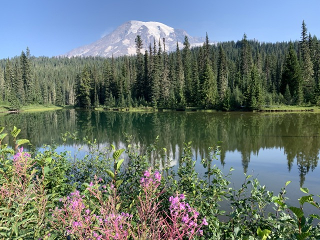

The [MeadoWatch](http://www.meadowatch.org/) program uses a community-science approach to monitor wildflower phenology at Mt Rainier National Park. We are interested in understanding how the timing of key plant phenophases (budding, flowering, fruiting, and seed release) will shift in response to climate change. This project is a collaboration between our lab, the Hille Ris Lambers Lab at [ETH Zurich](https://plantecology.ethz.ch/), and the National Park Service. 

---

