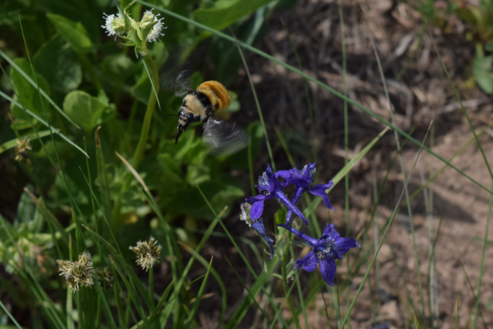
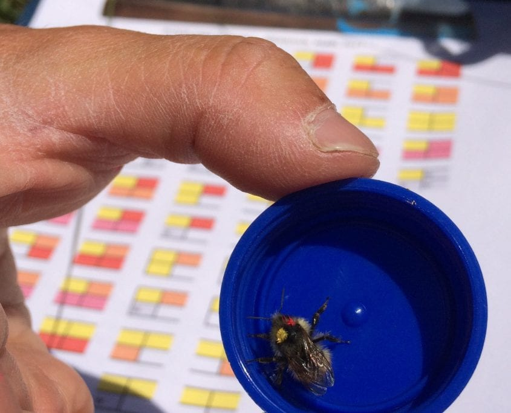
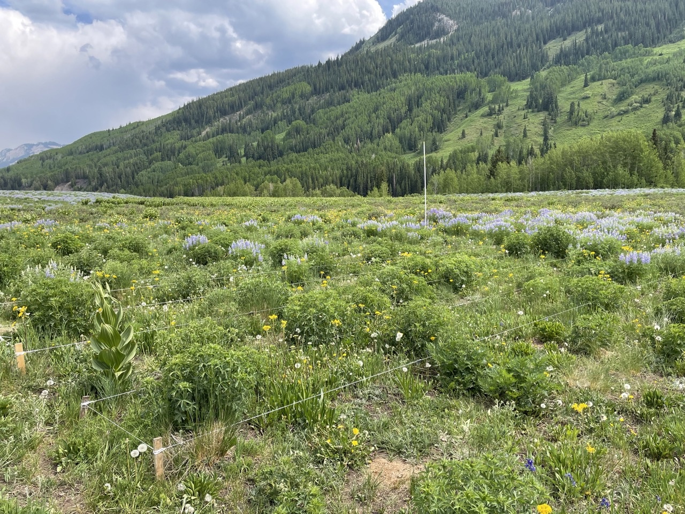

## Animal Behavior in a Functional Community-Ecology Context

Behavioral plasticity can be a key driver of network dynamics (adaptive foraging, re-wiring) and ecological functioning (e.g. pollinator behavior as a driver of pollination functioning). We are interested in a range of fundamental topics in behavior that affect these relationships, including intraspecific variation in behavior (a key research interest of Donna) and social information. We  developed a completely computer-controlled foraging enclosure, with artificial flowers whose rewards are triggered by tiny radio-frequency ID (RFID) tags that allows for nearly complete control of foraging rewards, allowing for powerful experimental approaches in behavior.

---
## Environmental Policy and Management

A key goal of our work is to translate our work and to synthesize other science in the service of environmental policy, management, and conservation. We have contributed broadly across these topics, but a particular element has been our work with biodiversity law expert Eric Biber (UC Berkeley) on a range of topics related to the US Endangered Species Act, in particular taking a quantitative, data-driven approach to its administration.

---
## Disease Ecology and Management
Our work on host-parasite interactions fits within our more general interest in how anthropogenic environmental change and human management affect species interactions. With funding from USDA and NIH, we have focused on how management of honey bees affects host-parasite coevolution and in particular the evolution of virulence, in the context of spatial structuring of transmission.

---
## Environmental Change Effects on Bee Community Structure
Understanding how environmental change affects ecological communities is key given the ongoing biodiversity crisis. Much of Berry’s doctoral and post-doctoral work focused on these themes, focused on how tropical deforestation and land-use affect bee communities. We finalized our work on this theme related to land-use changes surrounding biofuel feedstock cultivation in the southeastern US.

---
## Biodiversity — Ecological Functioning Relationships
A key interest in our group is the functional role of biodiversity: what happens to ecological functioning when biodiversity is lost? We are particularly interested in the role of phenotypic plasticity—both behavioral and morphological—in biodiversity-ecological functioning relationships (see our “behavior” research area for more). While we consider traditional “ecosystem” outcomes such as biomass production, we are also interested in “ecological” outcomes such as plant reproduction.

